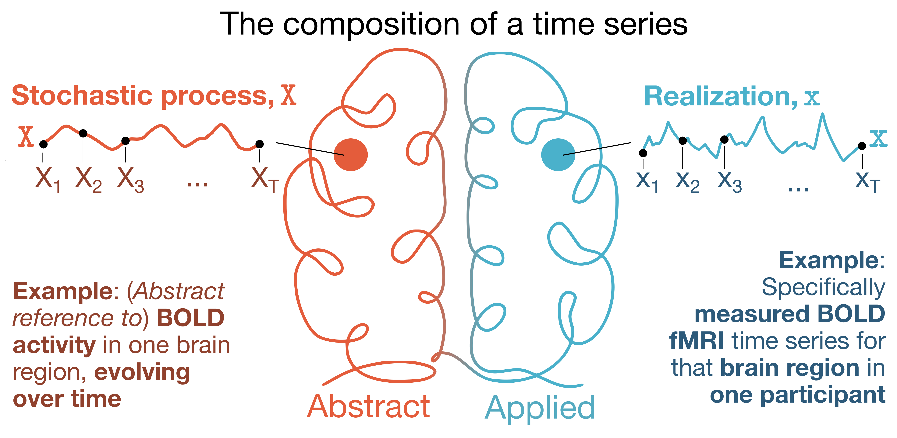

# Information-theoretic time series measures tutorial


This repository is designed as a simple guide to computing information-theoretic time-series measures covered in our (preprinted) review, ['Unifying concepts in information-theoretic time-series analysis'](https://arxiv.org/abs/2505.13080).

We work through the computation and interpretation of 11 measures (2 single-process and 9 pairwise) using two open-source software packages: 

1. Java Information Dynamics Toolkit ([JIDT](https://github.com/jlizier/jidt)); and 
2. Python toolkit of statistics for pairwise interactions ([pyspi](https://github.com/DynamicsAndNeuralSystems/pyspi))

Both are implemented in python, either directly (pyspi) or with a wrapper interface to java using [jpype](https://github.com/jpype-project/jpype) (JIDT).

## About the dataset in this guide



For our illustrative case study, we're working with resting-state BOLD fMRI data from one participant in the Human Connectome Project S1200 release (ID '298051', selected at random).
This resting-state fMRI dataset was preprocessed in ['Timescales of spontaneous fMRI fluctuations relate to structural connectivity in the brain'](https://pmc.ncbi.nlm.nih.gov/articles/PMC7888482) by John Fallon et al. *Network Neuroscience* (2020), where details about imaging acquisition, preprocessing, and data availability are all described. 
Here, we've used the 68-region [Desikan-Killiany](https://pubmed.ncbi.nlm.nih.gov/16530430/) cortical parcellation atlas, focusing on just one hemisphere (left) for simplicity.
The resting-state fMRI time series data for this participant (68 regions $\times$ 1200 timepoints) is included in this repository under [`data/HCP_298051_rsfMRI_DesikanKilliany_TS.csv`](https://github.com/anniegbryant/info_theory_visuals/blob/main/data/HCP_298051_rsfMRI_DesikanKilliany_TS.csv).

This pipeline is modality-agnostic, meaning you can adapt this code to datasets of different spatial and/or temporal measurement scales, too.

## 📚Prereqs to run this code

Not too much homework needed to get up and running here, fortunately! 
While JIDT is standalone software, it is also bundled as part of *pyspi*, so you will have both packages once you get *pyspi* on your computer.

You can install *pyspi* directly with `pip`; however, we recommend that you clone the GitHub repository to your local machine and then install from your cloned version, just so that you know precisely where your JIDT library is 😊

To clone *pyspi*, simply run:

```bash
git clone https://github.com/DynamicsAndNeuralSystems/pyspi.git
```

You can then install the python package by running:

```bash
# navigate to the freshly cloned repo
cd pyspi 
pip install .
```

While you're in there, navigate to the folder `pyspi/lib/jidt` and make sure you see the file `infodynamics.jar`. 
That's the executable Java file for JIDT, which we'll call from python using jpype.

That's pretty much it! 
To test that `pyspi` installed correctly, a simple sanity check might look like (in Python):

```python
from pyspi.calculator import Calculator

# Instantiating a Calculator object will load all of the measures computed by default in pyspi
# Meaning, if there is any issue it should be flagged with this
calc = Calculator()
```

### Data visualization prerequisites

If you would like to generate the same type of cortical surface visuals in our preprint:


You'll need to have a working installation of [R](https://www.r-project.org/) and the packages [`tidyverse`](https://github.com/tidyverse), [`ggseg`](https://github.com/ggseg/ggseg), [`cowplot`](https://github.com/wilkelab/cowplot), and [`patchwork`](https://github.com/thomasp85/patchwork) packages.
They can be installed within R from the terminal (including the one within RStudio) using: 

```R 
install.packages(c('tidyverse', 'ggseg', 'cowplot', 'patchwork'))
```

If you want to interactively run the data visualization code in this repository, please note that we've included both python and R code in one Jupyter notebook.
This is super useful for data wrangling between the two languages, though in its current form, this also means you will need to install the `rpy2` package in python:

```bash 
pip install rpy2
```

Sometimes this can be a bit of a headache depending on your operating system; worst case, you can copy--paste code into Python/R separately from the Jupyter notebook (described below) if you can't get `rpy2` installed on your computer.


## 🏃‍♀️Running the code

Once you've got *pyspi* installed and got eyes on the `infodynamics.jar` file, you're all set to start computing your information-theoretic time-series measures!
There are two steps to this: 

### Computing the measures

All code to compute the 11 information-theoretic time-series measures from the example resting-state fMRI dataset is provided in [`fMRI_compute_infotheory_measures.py`](https://github.com/anniegbryant/info_theory_visuals/blob/main/fMRI_compute_infotheory_measures.py).
You can take a look at the pre-computed measures in [`data/HCP_298051_rsfMRI_infotheory_measures.csv`](https://github.com/anniegbryant/info_theory_visuals/blob/main/data/HCP_298051_rsfMRI_infotheory_measures.csv) for a sense of what the results should look like.
If you want to compute the measures yourself for the same dataset, just delete (or relocate) the pre-computed measures and run the python script as:

```bash 
python3 fMRI_compute_infotheory_measures.py
```

### Visualizing the measures on the left hemisphere cortical surface

Whether you've computed the information-theoretic time-series measures yourself or would rather stick with the pre-computed results we provided, the final step is to visualize the resulting measures in the brain!

Check out the Jupyter notebook [`fMRI_analyze_infotheory_measures.ipynb`](https://github.com/anniegbryant/info_theory_visuals/blob/main/fMRI_analyze_infotheory_measures.ipynb), which loads in the information-theory measure results for this example participant and visualizes them on the left cortical surface using the `ggseg` package.

Note that this guide is admittedly cortico-centric, such that the visualization code will need to be tweaked a bit for non-cortical structures.
(n.b., if you're in the market for a similar style subcortex parcellation viz tool, I put together a [simple Python package](https://github.com/anniegbryant/subcortex_visualization) for this that you might like 😇)
